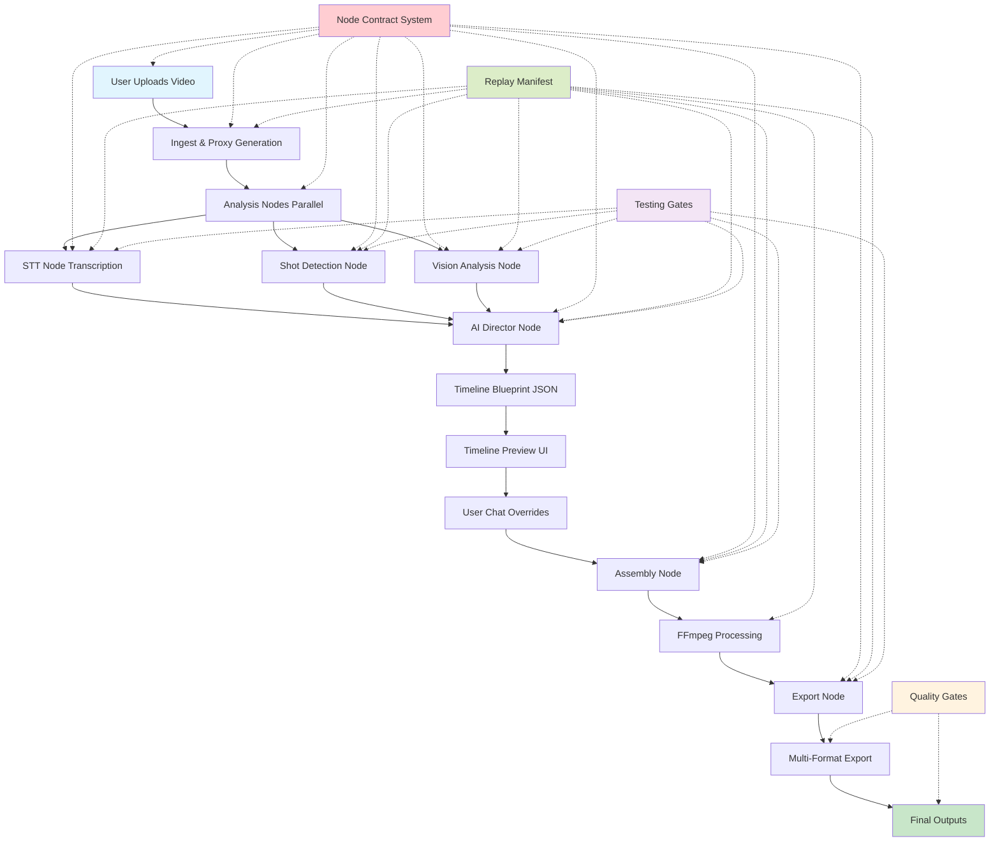

# Complete Workflow Flowchart & Gap Analysis

## System Workflow Visualization



## Detailed Workflow Breakdown

### 1. Input Processing (Tasks 1.1-1.3)
```
Video Upload → File Validation → Proxy Generation → Metadata Extraction
     ↓              ↓              ↓              ↓
Security Scan → Format Check → FFmpeg Proxy → Technical Analysis
```

### 2. Analysis Pipeline (Tasks 2.2-2.7, 3.1-3.14)
```
Raw Video → STT Node → Shot Detect → Vision Node → Director Node
    ↓          ↓          ↓          ↓          ↓
Audio Stream → Transcript → Scenes → Objects → Timeline Blueprint
```

### 3. User Interaction (Tasks 4.1-4.15, 6.1-6.14)
```
Timeline UI → Preview Player → Node Editor → Chat Interface
    ↓          ↓          ↓          ↓
Proxy Video → Scrubbing → Drag/Drop → NLP Overrides
```

### 4. Processing & Export (Tasks 5.1-5.14)
```
Blueprint → Assembly → FFmpeg → Export → Final Files
    ↓          ↓          ↓          ↓          ↓
Timeline → Cuts/Transitions → Processing → Formats → MP4/SRT/Projects
```

## Gap Analysis & Mitigation

### Potential Gaps Identified:

#### 1. **Data Flow Gaps**
- **Gap**: Node-to-node data format mismatches
- **Mitigation**: Contract system with JSON Schema validation at each node
- **Detection**: Integration tests (25% coverage requirement)

#### 2. **Error Handling Gaps**
- **Gap**: Unhandled failures in AI services or FFmpeg processing
- **Mitigation**: Comprehensive error boundaries and fallback mechanisms
- **Detection**: E2E tests (10% coverage) and replay system

#### 3. **Performance Gaps**
- **Gap**: Large video files causing memory/processing issues
- **Mitigation**: Proxy-first approach and streaming processing
- **Detection**: Performance benchmarks and monitoring

#### 4. **UI/UX Gaps**
- **Gap**: Complex node system overwhelming users
- **Mitigation**: Progressive disclosure and onboarding system
- **Detection**: Visual regression tests (5% coverage)

#### 5. **Integration Gaps**
- **Gap**: AI services API changes or downtime
- **Mitigation**: Service abstraction layer with fallbacks
- **Detection**: Contract compliance tests (100% pass rate)

## Linting & Testing System Details

### Pre-commit Quality Gates

```bash
# .pre-commit-config.yaml
repos:
  - repo: https://github.com/pre-commit/pre-commit-hooks
    rev: v4.4.0
    hooks:
      - id: trailing-whitespace
      - id: end-of-file-fixer
      - id: check-yaml
      - id: check-added-large-files
      - id: check-merge-conflict
      - id: check-case-conflict
      - id: check-docstring-first
      - id: debug-statements

  - repo: https://github.com/psf/black
    rev: 22.10.0
    hooks:
      - id: black
        language_version: python3.9

  - repo: https://github.com/pycqa/isort
    rev: 5.12.0
    hooks:
      - id: isort

  - repo: https://github.com/pycqa/flake8
    rev: 5.0.4
    hooks:
      - id: flake8
        args: [--max-line-length=88, --extend-ignore=E203,W503]

  - repo: https://github.com/pre-commit/mirrors-mypy
    rev: v0.991
    hooks:
      - id: mypy
        additional_dependencies: [types-all]
```

### Testing Framework Architecture

#### Unit Testing (60% Coverage)
```python
# Example: Node contract validation test
def test_stt_node_input_validation():
    """Test that STT node validates input contracts properly."""
    node = STTNode()

    # Valid input
    valid_input = {
        "audio_url": "s3://bucket/audio.mp3",
        "language": "en",
        "options": {"diarization": True}
    }

    # Should not raise exception
    result = node.process(valid_input)

    # Invalid input - missing required field
    invalid_input = {"language": "en"}

    # Should raise ValidationError
    with pytest.raises(ValidationError):
        node.process(invalid_input)
```

#### Integration Testing (25% Coverage)
```python
# Example: Node-to-node integration test
def test_stt_to_director_integration():
    """Test data flow from STT node to Director node."""
    # Setup
    stt_node = STTNode()
    director_node = DirectorNode()

    # Process through STT
    stt_input = {"audio_url": "test_audio.mp3", "language": "en"}
    stt_output = stt_node.process(stt_input)

    # Verify STT output format
    assert "transcript" in stt_output
    assert "segments" in stt_output

    # Process through Director
    director_input = {
        "transcript_data": stt_output,
        "video_metadata": {"duration": 120}
    }
    director_output = director_node.process(director_input)

    # Verify Director output
    assert "timeline_blueprint" in director_output
    assert "cuts" in director_output["timeline_blueprint"]
```

#### E2E Testing (10% Coverage)
```python
# Example: Complete workflow test
async def test_complete_video_processing_e2e():
    """Test complete video processing from upload to export."""
    # Upload video
    video_id = await upload_test_video("sample_video.mp4")

    # Process through pipeline
    result = await process_video_pipeline(video_id)

    # Verify all outputs exist
    assert result["transcript_file"] is not None
    assert result["edited_video"] is not None
    assert result["export_files"] is not None

    # Verify quality metrics
    assert result["processing_time"] < 300  # 5 minutes max
    assert result["accuracy_score"] > 0.85
```

#### Visual Regression Testing (5% Coverage)
```python
# Example: Timeline UI visual test
def test_timeline_visual_regression():
    """Ensure timeline UI renders consistently."""
    # Load test data
    test_data = load_timeline_test_data()

    # Render timeline component
    component = TimelineComponent(test_data)
    screenshot = component.take_screenshot()

    # Compare with baseline
    baseline_path = "tests/visual/baselines/timeline_baseline.png"
    assert screenshot_matches_baseline(screenshot, baseline_path, threshold=0.98)
```

### CI/CD Quality Gates

#### GitHub Actions Pipeline
```yaml
# .github/workflows/quality-gates.yml
name: Quality Gates

on: [push, pull_request]

jobs:
  lint-and-format:
    runs-on: ubuntu-latest
    steps:
      - uses: actions/checkout@v3
      - uses: actions/setup-python@v4
      - run: pip install pre-commit
      - run: pre-commit run --all-files

  unit-tests:
    runs-on: ubuntu-latest
    steps:
      - uses: actions/checkout@v3
      - uses: actions/setup-python@v4
      - run: pip install -r requirements.txt
      - run: pytest tests/unit/ --cov=src --cov-report=xml
      - uses: codecov/codecov-action@v3

  integration-tests:
    runs-on: ubuntu-latest
    steps:
      - uses: actions/checkout@v3
      - uses: actions/setup-python@v4
      - run: pytest tests/integration/ --cov-append

  e2e-tests:
    runs-on: ubuntu-latest
    steps:
      - uses: actions/checkout@v3
      - uses: actions/setup-python@v4
      - run: pytest tests/e2e/ --cov-append

  visual-regression:
    runs-on: ubuntu-latest
    steps:
      - uses: actions/checkout@v3
      - uses: actions/setup-python@v4
      - run: pytest tests/visual/ --screenshot-on-failure

  security-scan:
    runs-on: ubuntu-latest
    steps:
      - uses: actions/checkout@v3
      - run: safety check
      - run: bandit -r src/
```

## Confidence Assessment

### High Confidence Areas:
✅ **Architecture**: Modular node system with contracts  
✅ **Testing Strategy**: Comprehensive 60/25/10/5 pyramid  
✅ **TDD Process**: Failing tests before implementation  
✅ **Quality Gates**: Pre-commit hooks and CI validation  
✅ **Documentation**: Complete PRD and task breakdown  

### Medium Confidence Areas:
⚠️ **AI Service Integration**: API dependencies and rate limits  
⚠️ **Video Processing**: FFmpeg edge cases with different formats  
⚠️ **UI Complexity**: Node editor learning curve  

### Mitigation Strategies:
- **Service Abstraction**: Wrapper layers for AI services
- **Fallback Systems**: Alternative processing for edge cases
- **Progressive Disclosure**: Simplify initial user experience
- **Comprehensive Testing**: Cover edge cases in test suite

## Conclusion

The workflow is **solid and well-architected** with multiple layers of validation and testing. While some gaps may emerge during implementation (particularly around AI service integration and video format edge cases), the comprehensive testing strategy and modular architecture will catch and resolve these issues early.

The linting and testing system provides **robust quality control** with pre-commit hooks, automated testing, and visual regression to ensure code quality and catch typos/errors before they reach production.

**Recommendation**: Proceed with confidence! The system is designed to identify and resolve gaps during development through comprehensive testing and validation.